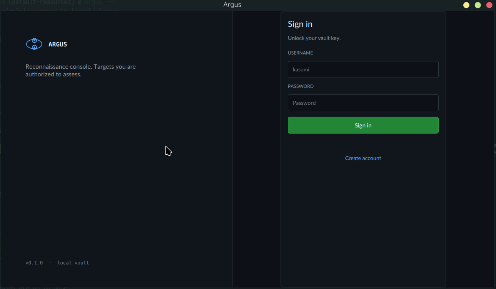
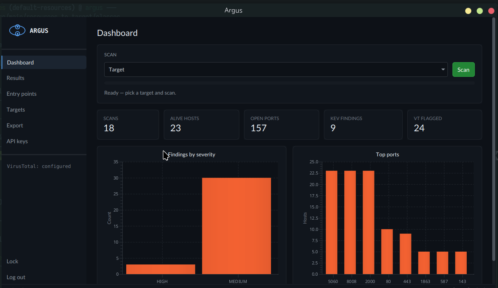
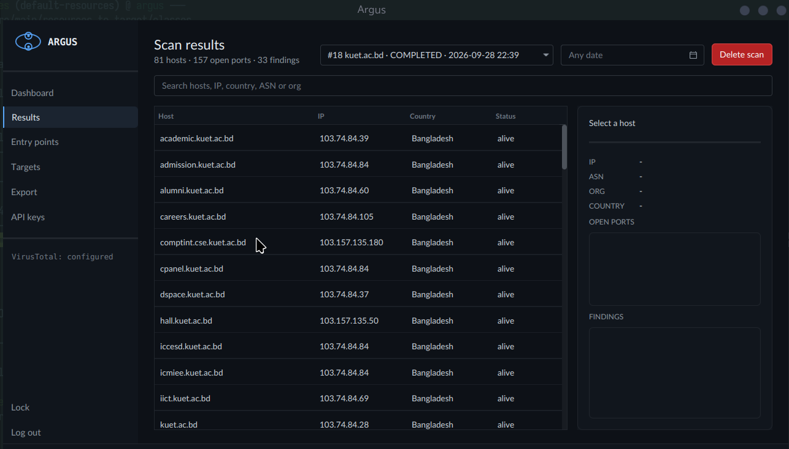
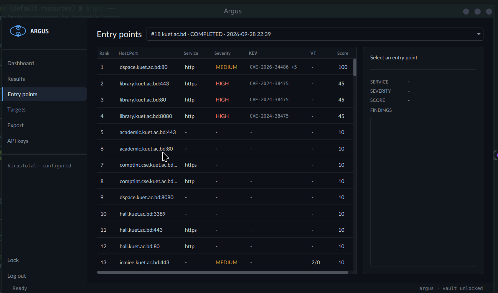
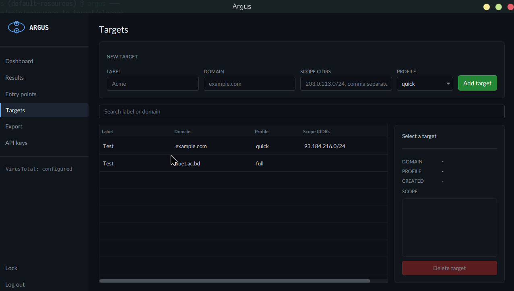
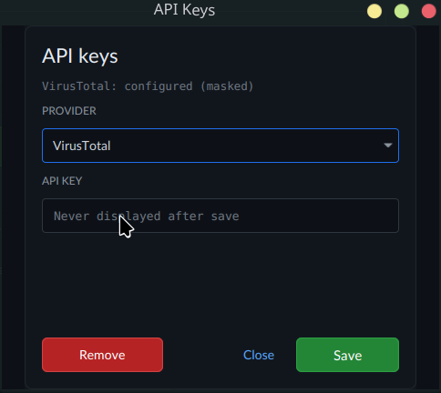

# Argus

Local-first reconnaissance and target-package generator for authorized security
assessment. Subdomain enumeration, port discovery, service fingerprinting,
known-exploitable-vulnerability matching, and a ranked entry-point list you can
hand to whoever owns the assessment.

Everything runs on your machine. The only outbound traffic is to the data
providers listed below. There is no service, no account, and no telemetry.




## What it does

1. **Enumerate subdomains** for a target root domain through certificate
   transparency logs.
2. **Resolve** the names and keep what points at a routable address.
3. **Probe ports** from a ranked list, so likely-open ports are tried first.
4. **Fingerprint services** by reading the banner and page title.
5. **Match banners against CISA KEV** to flag software with a known exploited
   vulnerability.
6. **Enrich live hosts** with geolocation, ASN and network owner, then check
   reputation against VirusTotal.
7. **Rank entry points** by a published priority score.
8. **Export a target package** as Markdown or JSON.

It is a discovery tool. It does not exploit, brute force, or evade detection,
and it contains no code that attempts to.

## Screenshots

| | |
|---|---|
|  |  |
| Results, with the selected host's network detail and open ports | Entry points, with the selected port's findings |
|  |  |
| Targets, with scope and profile | Provider key storage |

## Requirements

- JDK 21 or newer
- Maven 3.9 or newer
- A network path to the providers below, or an expectation of degraded results
- A display, for the interface

## Build and run

```bash
mvn clean package
mvn javafx:run
```

On first start the application creates an operator account. There is no default
password and no reset path, so keep the one you choose: the vault key is derived
from it and cannot be recovered if lost.

## How a scan runs

Six stages, each with its own worker pool and a cancellation token. A stage
drains before the next one starts.

```
crt.sh  ->  DNS resolve  ->  port scan  ->  banner grab  ->  KEV match  ->  collect
                                                                            |
                                          ip-api enrichment <--------------+
                                                    |
                              VirusTotal reputation on the top 10 IPs <---+
```

- Subdomain enumeration reads certificate transparency records for the root
  domain.
- Port scanning uses virtual threads, one per probe.
- The run stops after one hour, whichever stage it is in.
- Cancelling or closing the window mid scan marks the run and keeps the results
  collected so far. A run still marked `RUNNING` at the next start is marked
  `FAILED` on startup rather than left dangling.
- Enrichment happens after the pipeline, because both providers need the final
  host set. A provider failure degrades the result for that provider and never
  fails the scan.

### Port profiles

| Profile | Ports |
|---|---|
| `quick` | 100, frequency ranked |
| `full` | 1000, frequency ranked |
| `custom` | your own list, comma separated, 1 to 65535 |

The ranked lists come from a real port frequency census, so the common web,
mail and remote access ports are probed before the long tail. Saving a custom
profile replaces it for every later scan.

## Entry point ranking

Each open port gets a score, capped at 100. The list shows the top 100.

| Signal | Points |
|---|---|
| KEV match, confirmed | 35 |
| KEV match, candidate | 15 |
| Known ransomware family in the CVE | 10 |
| VirusTotal flags it, 3 or more engines | 10 |
| Internet-facing web or admin port | 10 |

Ranking ties break on `host:port`, so the same scan always produces the same
list, and the view and the export agree on it.

## Data providers

| Provider | Used for | Key required | Quota behaviour |
|---|---|---|---|
| [crt.sh](https://crt.sh) | Subdomain enumeration | No | 24 hour response cache, one call per scan |
| [CISA KEV](https://www.cisa.gov/known-exploited-vulnerabilities-catalog) | Vulnerability matching | No | 7 day cache, bundled snapshot fallback when the feed is unreachable |
| [ip-api.com](https://ip-api.com) | Country, ASN, network owner | No | 7 day per-IP cache, batched, 100 addresses per request |
| [VirusTotal](https://www.virustotal.com) | IP reputation | Yes | 24 hour cache, 4 requests per 15 seconds, top 10 ranked IPs only |

Provider keys are encrypted in the local database, never logged, and never
included in an export.

## Configuration

Keys are entered in the interface and stored encrypted. For scripting or a
throwaway environment, a key can come from the environment instead:

```bash
export ARGUS_VT_KEY=...
mvn javafx:run
```

An environment key is read at run time and never written to disk. It is a
development convenience, not a replacement for the vault, and a real value does
not belong in version control.

## Where your data lives

One SQLite file, by default:

```
~/.argus/argus.db
```

It holds operators, targets, scans, hosts, ports, findings, encrypted provider
keys, a provider response cache, and an audit log of authentication and lock
events. Delete the file to reset the application. Back it up if you want to keep
scan history, and treat it as sensitive: it contains the encrypted keys.

## Security notes

- Passwords are stored as a PBKDF2-HMAC-SHA256 verifier, 600,000 iterations, and
  are never stored or logged in the clear.
- The vault key is derived from the password with a separate salt, held in memory
  only for the session, and wiped when the session ends.
- Provider keys are encrypted with AES-256-GCM using a fresh random IV per
  encryption.
- Failed logins are counted and written to the audit log. The fifth locks the
  account for 30 seconds, doubling per further failure up to 15 minutes.
- The session locks itself after five minutes of inactivity and requires the
  password to unlock.
- The interface never renders a stored key.

## Authorized use

Argus enumerates and probes hosts. Point it only at infrastructure you own or
have written permission to assess, and get that permission in writing. Depending
on where you run it, active probing and certificate transparency queries can
involve third-party infrastructure you do not control, and their terms of service
and applicable law apply to you.

## Project layout

```
src/main/java/com/argus/
  core/        pipeline stages, scanner, providers, crypto, concurrency, export
  db/          SQLite DAOs
  ui/          JavaFX controllers, view models, FXML and CSS
src/main/resources/
  com/argus/ui/view/   FXML views and the design token sheet
  kev/        bundled KEV snapshot, product aliases, version ranges
  ports/      ranked port lists
src/test/java/         the suite
docs/fixtures/         recorded provider responses, so tests never call out
```

## Tests

```bash
mvn verify
```

170 tests. The suite makes no live network calls: provider behaviour is tested
against recorded responses in `docs/fixtures` and a local HTTP server, so a run
costs nothing and needs no keys. A handful of tests load the interface, which
needs a display, so the suite is a local gate rather than something to run
headless in CI.

## Limitations

- Subdomain enumeration depends on certificate transparency coverage. A host
  that never appeared in a certificate log will not be found.
- Service fingerprinting reads banners and page titles. It identifies what a
  service advertises, not what it is.
- KEV matching is a version range comparison against the banner. A mismatched or
  generic banner produces no match rather than a wrong one, so false negatives
  are expected.
- Reputation is sampled. Only the top ten ranked IPs are checked, to stay inside
  a free tier.
- Nothing here is a substitute for authorisation or for a human reading the
  results.

## License

No license has been chosen yet. Add one before publishing.
